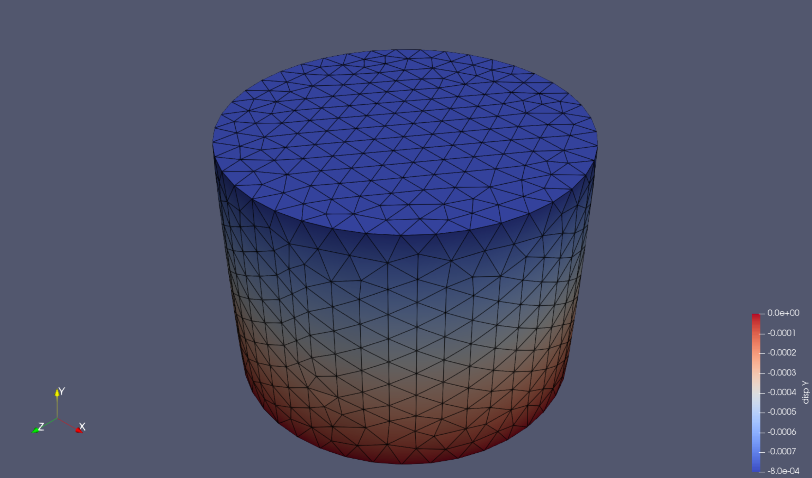

# Zig Raster
My implementation of a rasterisation renderer in Zig. I am using this project to learn Zig for scientific computing applications and a rasteriser includes enough linear algebra to explore the language for this purpose. I come from a Python background with some limited experience in Cython and C but wanted a new high performance compiled language with good Python interop, hence Zig.

The rasteriser is built using [Zig 0.14](https://ziglang.org/download/) and can be run using:
```shell
zig run -O ReleaseFast src/main_raster.zig
```

This project is inspired by the rasteriser implementation on [Scratchapixel](https://www.scratchapixel.com/index.html), this taught me a lot about computer graphics! See their description of the rasterisation process [here](https://www.scratchapixel.com/lessons/3d-basic-rendering/rasterization-practical-implementation/overview-rasterization-algorithm.html) and their code [here](https://github.com/scratchapixel/scratchapixel-code/tree/main/rasterization-practical-implementation).

## Test Case
The test case for rendering is a finite element solid mechanics simulation of a linear elastic cylinder loaded in compression, see visualisation below of the vertical displacement field using [Paraview](https://www.paraview.org/). The goal of the test case is to render the vertical displacement field based on given camera parameters. I performed this simulation using [Gmsh](https://gmsh.info/) to create the mesh and [MOOSE](https://mooseframework.inl.gov/) as the physics solver. The Gmsh `.geo` and MOOSE input `.i` file can be found in the [data directory](https://github.com/ScepticalRabbit/zigraster/tree/main/data). I skinned the 3D mesh using `pyvista` then I parsed the surface mesh (nodal coordinates and connectivity table) and the output displacement field to `.csv` files to be read into Zig (files are in the [data directory](https://github.com/ScepticalRabbit/zigraster/tree/main/data)). Note that the simulation itself is in SI units but the `.csv` files have been scaled to `mm`.

||
|:--:|
|*Rasterisation rendering test case: a linear elastic cylinder loaded in compression showing the vertical displacement field.*|

## Core Functionality
This project provides support for basic linear algebra operations on vectors and matrices through the `Vector` and `Matrix` types. This supports small vectors and matrices through the types: `Vec2f`, `Vec3f`,` Mat22f`, `Mat33f` and `Mat44f`.